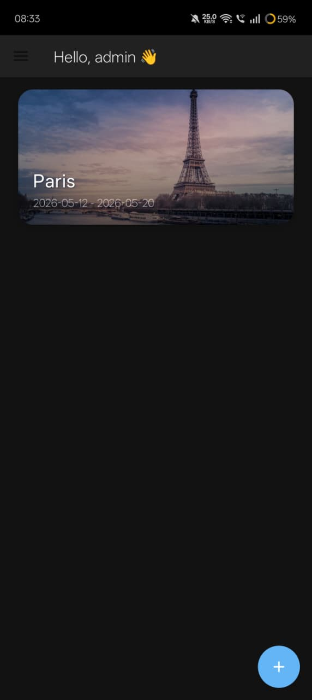
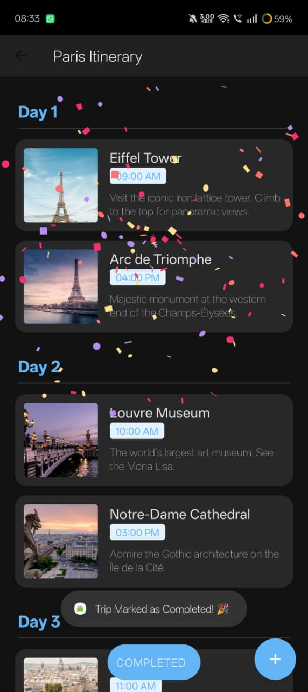
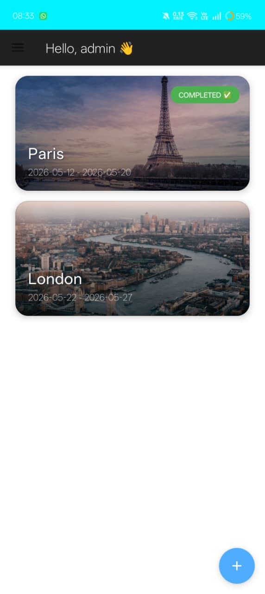

# Itinerary App 🌍✈️

**Itinerary App** is a modern, native Android application designed to help users plan, organize, and manage their trips effortlessly. With its smart, automated itinerary generation engine, TravelEase takes the hassle out of travel planning by providing realistic, day-wise travel plans and smart destination recommendations.

## 🚀 Features

*   **Smart Itinerary Generation:** Automatically generates day-by-day itineraries for popular global destinations (e.g., Paris, London, Tokyo, New York, Rome, Dubai, Sydney, Goa, Kyoto, Singapore, New Delhi).
*   **Trip Management:** Add new trips with beautiful destination images, specify start and end dates, and keep track of your travel timeline.
*   **Activity Tracking:** Add custom activities to any day of your trip, complete with time, notes, and cover images.
*   **Smart Recommendations:** Suggests the next logical travel destination based on your current trip's category (e.g., Classic Europe, Modern Asia, Iconic Metropolises).
*   **Mark as Completed:** Celebrate your completed trips with a beautiful and dynamic confetti animation (`Konfetti-xml`).
*   **User Authentication:** Fully functional Login and Sign-up screens for a personalized experience.
*   **Theme Support:** Toggle between beautiful Light and Dark modes seamlessly.
*   **Offline Support:** All trip and activity data is stored locally using SQLite, ensuring your itineraries are accessible even without internet access.

## 🛠 Tech Stack

*   **Language:** Java
*   **Architecture:** MVC/MVVM-inspired clean structure
*   **Local Database:** SQLite (`SQLiteOpenHelper`)
*   **UI Components:** Material Design 3, `RecyclerView`, `CardView`, Navigation Drawer
*   **Image Loading:** Glide (for fetching Unsplash images)
*   **Animations:** Konfetti-XML (for celebratory completed trip animations)
*   **Build System:** Gradle

## 📁 Project Structure

*   `activities/` - Contains all Activity classes (`MainActivity`, `AddTripActivity`, `TripDetailsActivity`, `LoginActivity`, etc.)
*   `adapters/` - `RecyclerView` adapters for rendering lists of trips and activities.
*   `db/` - Contains the `DatabaseHelper` class for managing SQLite operations.
*   `models/` - Data classes (`Trip`, `ActivityModel`, `User`).

## 📱 Screenshots






## ⚙️ How to Run the Project

1.  **Clone the repository:**
    ```bash
    git clone <your-repository-url>
    ```
2.  **Open in Android Studio:**
    *   Launch Android Studio.
    *   Select `File > Open...` and choose the cloned directory.
3.  **Sync Gradle:**
    *   Allow Android Studio to sync the project and download all necessary dependencies (Glide, Material, Konfetti).
4.  **Run the App:**
    *   Select your emulator or connected Android device.
    *   Click the **Run** button (green triangle) in the toolbar.

## 📝 License

This project is open-source and available under the [MIT License](LICENSE).

